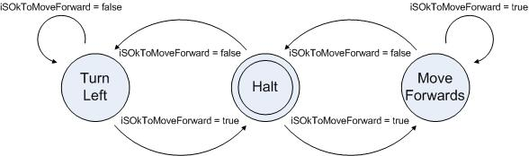

# Simple Robot Collision Avoidance Sketch

## Description

The robert will move around a room, avoiding obstacles using the Forwards Ultrasonic Sensor, as per the following state machine diagram:

## Unit Tests

The unit tests are controlled by the constant `RUN_UNIT_TESTS` which in turn applies conditional compilation using the preprocessing directives `#ifdef` `#ifndef` and `#endif`.  You either run the unit tests using `#define RUN_UNIT_TESTS` or you run the robot program.  You can not run both at the same time.  This is because the unit tests start to run after the first call to `moveRobot()` resulting in the failure of the first assertion in `test(ReadyToPingForward)`.

Another issue with the unit tests is that you cannot predict the order that the tests will run.  For this reason, there are a number of assertions in `test(ReadyToPingForward)` to ensure the assertions are run in the correct order.

## Using git and github

Ensure you understand the github workflow: https://guides.github.com/introduction/flow/index.html

Please keep pull requests focused on one thing only, since this makes it easier to merge and test in a timely manner.

If you need help with pull requests there are guides on github here:

https://help.github.com/articles/creating-a-pull-request/

The main flow for a contributing is as follows:

1. Login to github, go to the github_exercise_student repository and press `fork`.
2. Then using the command line/terminal on your computer: `git clone <url to YOUR fork>`
3. `cd github_exercise_student`
4. `git checkout master`
5. `git checkout -b my-new-code`
6. Make changes
7. `git add <files that have changed>`
8. `git commit -m "<short description of change>"`
9. `git push origin my-new-code`
10. Create pull request using github UI to merge your changes from your new branch into `github_exercise_student/master`
11. Repeat from step 4 for other new changes.

The primary thing to remember is that separate pull requests should be created for separate branches.  Never create a pull request from your `master` branch.

Later, you can get the changes from the github_exercise_student repo into your local `master` branch by adding github_exercise_student as a git remote and merging from it as follows:

1. `git remote add <https URL to github_exercise_student/github_exercise_student.git>`
2. `git checkout master`
3. `git fetch github_exercise_student`
4. `git merge github_exercise_student/master`
5. `git push origin master` is an optional step that will update your fork on github
